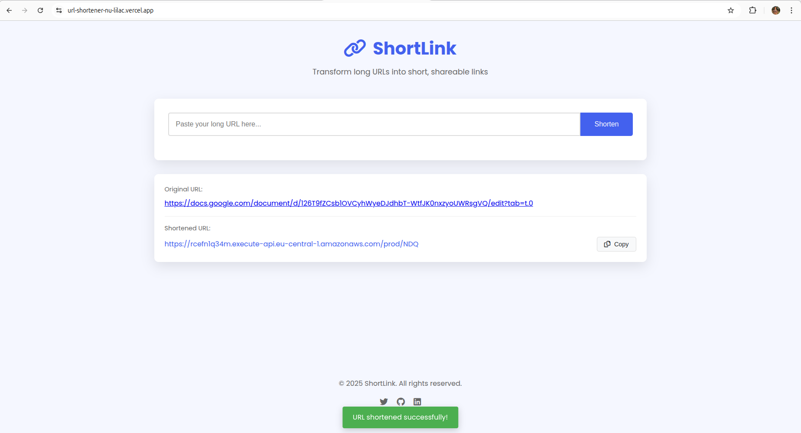
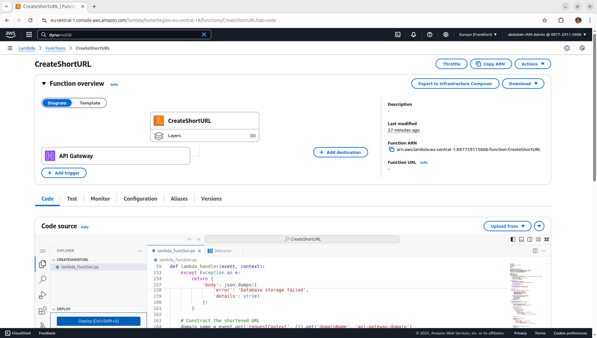
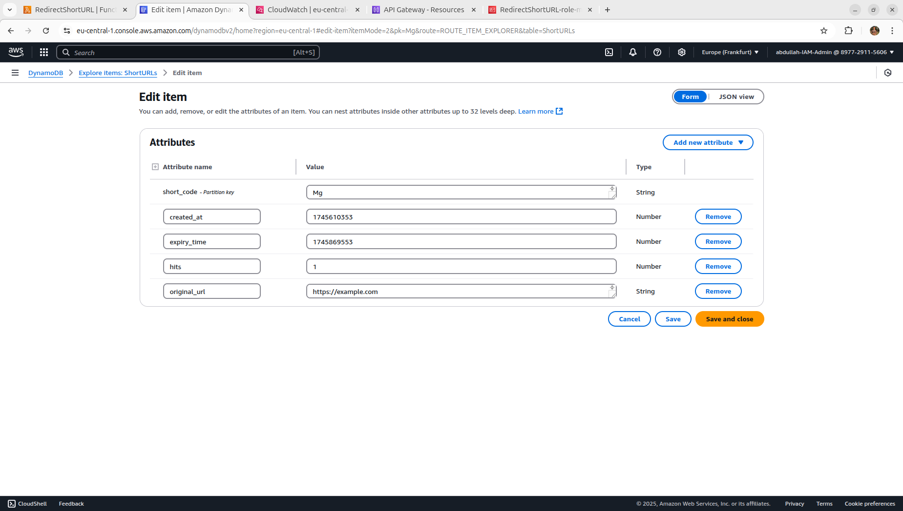

# **🔗 URL Shortener - AWS Lambda + DynamoDB + Vercel**  

A high-performance URL shortener service built with **AWS Lambda, DynamoDB, API Gateway, and Vercel**. Shorten long URLs instantly and track usage with a simple, scalable architecture.  



🚀 **Live Demo**: [https://url-shortener.vercel.app](https://url-shortener.vercel.app)  

---

## **✨ Features**  
✔ **Shorten URLs** – Convert long links into short, shareable URLs.  
✔ **Automatic Redirects** – Accessing a short URL redirects to the original.  
✔ **DynamoDB Storage** – Highly scalable NoSQL database for URL mappings.  
✔ **Visit Counter** – Track how many times a short URL is accessed.  
✔ **Serverless API** – Built with AWS Lambda & API Gateway (cost-efficient).  
✔ **Modern Frontend** – Responsive UI hosted on **Vercel**.  

---

## **🛠 Tech Stack**  

| **Category**       | **Technology**                          |  
|--------------------|----------------------------------------|  
| **Backend**        | AWS Lambda (Python)                    |  
| **Database**       | DynamoDB (NoSQL)                       |  
| **API Gateway**    | AWS API Gateway (REST)                 |  
| **Frontend**       | HTML, CSS, JavaScript                  |  
| **Deployment**     | Vercel (Frontend)                      |  
| **Permissions**    | AWS IAM (Security Policies)            |  

---

## **📂 Project Structure**  

```bash
.
├── /frontend/            # Frontend (HTML, CSS, JS)
│   ├── index.html        # Main UI
│   ├── styles.css        # Styling
│   └── script.js         # API Interaction           
├── server.js             # Node.js local server
└── README.md             # This documentation
```

---

## **⚙️ Setup & Deployment**  

### **1. AWS Backend Setup** 
 
1 . **Create Lambda Functions** (`RedirectShortURL`, `CreateShortURL`)  
2 . **Set Up DynamoDB Tables** (`ShortURLs`, `URLCounter`)  
3 . **Configure API Gateway** (REST API with `POST /shorten` & `GET /{short_code}`)  
4 . **Enable CORS & IAM Permissions**  

📌 [See Full AWS Setup Guide](#aws-services-used)  

### **2. Frontend Deployment (Vercel)**  
```bash
# Install Vercel CLI (if needed)
npm install -g vercel

# Deploy
vercel deploy
```

---

## **🔍 How It Works**  

### **🔗 Short URL Generation**  
1 . User submits a long URL → `CreateShortURL` Lambda generates a **6-character code**.  
2 . The mapping (`short_code` → `long_url`) is stored in **DynamoDB**.  
3 . The counter increments in `URLCounter`.  

### **🔄 Short URL Redirection**  
1 . User visits `https://api.example.com/abc123`  
2 . `RedirectShortURL` Lambda fetches the original URL from **DynamoDB**.  
3 . **301 Redirect** is triggered to the long URL.  

---

## **📡 API Endpoints**  

| **Method** | **Endpoint**       | **Description**                     |  
|------------|--------------------|-------------------------------------|  
| `POST`     | `/shorten`         | Create a short URL (Input: `{"url": "..."}`) |  
| `GET`      | `/{short_code}`    | Redirect to original URL            |  

### **Example Request (CURL)**  
```bash
# Shorten a URL
curl -X POST https://your-api.execute-api.us-east-1.amazonaws.com/shorten \
  -H "Content-Type: application/json" \
  -d '{"url": "https://example.com/very-long-url"}'

# Response
{"short_url": "https://your-api.execute-api.us-east-1.amazonaws.com/abc123"}
```

---

## **📸 Screenshot**  

|  |  |  
|:--------------------------------------------------------:|:---------------------------------------------------:|  
| *AWS Lambda Functions*                                   | *DynamoDB Tables*                                  |  

|         |  |  
|:--------------------------------------------------------:|:---------------------------------------------------:|  
| *API Gateway Configuration*                             | *Live Frontend on Vercel*                          |  


---

## 📜 **License**  
MIT © [ABDULLAH SIRAJ].  
For support, contact: [dev.abdullah21@gmail.com](mailto:dev.abdullah21@gmail.com)  

---

## **💡 Contributors & Feedback**  
👋 **Your contributions are welcome!**  
- Report issues 🐛  
- Suggest features 💡  
- Submit PRs 🔄  

**Let’s make this URL shortener even better!** 🚀  


**🌟 Enjoyed this project? Give it a ⭐ on GitHub!**  
